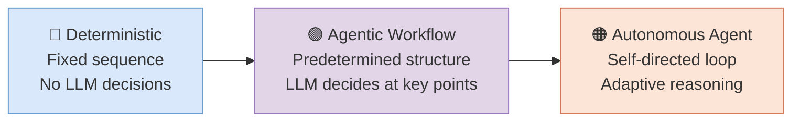

# Foundations — From the Agent Loop to the Paradigm Shift

→ [[02 - Tools]]

---

## The Agency Spectrum — From Deterministic Workflows to Autonomous Agents

Before building anything, it helps to understand what an agent is — and, more importantly, to recognize that "agent vs. not agent" is the wrong framing. The real question is *how much agency* your system needs. This is a spectrum, not a binary choice [^48].

At one end sit **deterministic workflows** — predefined code paths where every step is fixed. A **workflow** here means a sequence of operations orchestrated by conventional code: the developer decides what happens, in what order, with what inputs. A classic RAG pipeline (retrieve documents, stuff them into a prompt, generate a response) is a deterministic workflow: the same input always triggers the same sequence. These are fast, cheap, and predictable.

Five composable workflow patterns cover a remarkable amount of ground [^1][^29]: **Prompt Chaining** (output of one LLM call feeds the next), **Routing** (an LLM classifies the input and dispatches to the right handler), **Parallelization** (fan out the same task to multiple LLMs and merge), **Orchestrator-Workers** (a coordinator LLM dispatches subtasks to worker LLMs), and **Evaluator-Optimizer** (one LLM generates, another critiques, repeat). These are the atoms from which all agent systems are assembled.

Notice that several of these patterns already involve LLM decision-making. A Routing workflow uses a model to classify and dispatch — the model chooses the path. An Evaluator-Optimizer uses a model to critique and iterate — the model decides when quality is sufficient. These are **agentic workflows**: they have partial agency (the model makes some decisions) within a controlled, predetermined structure. They are more autonomous than a rigid pipeline, but less autonomous than a fully self-directed agent.

At the far end of the spectrum sits the **autonomous agent**, running the full reasoning loop: **Thought** (reason about the current state and decide what to do), **Action** (call a tool, then stop generating), **Observation** (receive the tool's results back into context, and repeat) [^26]. Unlike a workflow, the steps here are *not* predetermined — the agent decides what to do next based on what it sees. This is genuinely adaptive, multi-step reasoning.

**Three action formats** exist for how agents invoke tools. **JSON-based function calling** is the most widely supported approach — the model outputs a structured JSON payload specifying which function to call and with what parameters. This is the default in OpenAI, Google, and most frameworks. **Code generation** is an alternative where the model writes executable code that calls tools as functions — pioneered by HuggingFace's smolagents [^26] and used effectively in several production systems [^14]. One study showed +11% accuracy and -24% token usage for code-based tool calls [^12], though results are task-dependent. **MCP (Model Context Protocol)** [^46] is a standardized protocol for tool discovery and invocation, providing a universal adapter between agents and tools regardless of the model or framework being used.

**The practical takeaway:** start at the deterministic end of the spectrum and add agency only where it demonstrably improves outcomes [^1][^48]. Many teams find their sweet spot somewhere in the middle — agentic workflows where the structure is predetermined but the model makes key decisions within that structure. Fully autonomous agents earn their complexity only when the task genuinely requires adaptive, multi-step reasoning that you cannot predetermine.

> [!summary] Key Takeaways
> 1. Agency is a spectrum from deterministic → agentic workflow → autonomous agent. Choose the minimum level that solves your problem.
> 2. Agentic workflows (LLM decisions within predetermined structure) are often the sweet spot — more flexible than rigid pipelines, more predictable than autonomous agents.
> 3. The five composable patterns (Chaining, Routing, Parallelization, Orchestrator-Workers, Evaluator-Optimizer) are the building blocks for all agent architectures.
> 4. Tool invocation has three formats — JSON function calling (most common), code generation (more expressive), MCP (standardized discovery) — each with different tradeoffs.
> 5. Start simple. Add agency only when you can measure the improvement it brings.

## The Paradigm Shift: It's the Harness, Not the Model

Assuming you've determined where on the agency spectrum your system should sit, the next thing to internalize is where the real engineering challenge lies — and it is probably not where you expect.

The bottleneck has shifted from model intelligence to the **harness** [31]. The harness is a term that has emerged in the agent engineering community to describe *everything around the model*: the system prompt that shapes its behavior, the tool definitions it can call, the context management strategy that controls what it sees, the caching layer that controls what you pay, the memory system that persists across sessions, the subagent architecture that splits work, and the orchestration logic that ties it all together. The model itself is just one component — often the least differentiating one, since multiple teams use the same model but get wildly different results depending on their harness.

A useful analogy: the model is the CPU, the context window is RAM, and the harness is the operating system. You can upgrade the CPU (use a better model), but if the OS is poorly designed — if it loads the wrong data, manages memory badly, or dispatches tasks inefficiently — performance won't improve. This is why Manus rewrote their harness five times before getting it right [^13], and why Vercel *removed* 80% of their tools and saw their agent improve [^5]. More is not better; better is better. "The space of interesting harness combinations doesn't shrink. It moves." [^5]

Practitioners across different organizations and model providers have independently converged on three principles — call them the **Three Laws of Agent Engineering**:

**Law 1: Give the agent a computer, not more tools** [^12][^13][^14]. The instinct is to build a dedicated tool for every action the agent might need. But this creates a bloated action space — the model spends tokens deciding *which tool to use* rather than doing the work. The alternative: give the agent a small set of general-purpose primitives (bash, filesystem, code execution) and let it compose solutions. This is the two-layer action space from the next chapter. Cloudflare's Code Mode demonstrated this powerfully — their agent uses a code interpreter as its primary tool and achieves tasks that would require dozens of dedicated tools [^14].

**Law 2: Context is the bottleneck** [^2]. The model can only reason about what it can see. If critical information is missing from context, no amount of model intelligence compensates. If irrelevant information clutters context, the model wastes capacity on noise. Every decision about what to include, exclude, cache, or summarize is a design decision with direct consequences for agent quality. This is so important that it gets its own chapter (Chapter 3).

**Law 3: Constantly ask "what can I stop doing?"** [^4][^5]. The best harness improvements often come from *removal*, not addition. Every component you strip without degrading eval metrics is one less thing to maintain, debug, and pay for. This is counterintuitive — engineers want to add capabilities — but the evidence is consistent: simpler harnesses with fewer, better-designed components outperform complex ones.

**Economics reinforce these principles.** For API-based models, the key cost lever is **prompt caching** — a mechanism where the model provider stores the processed representation of your prompt prefix, so subsequent requests that share the same prefix skip the expensive processing step. Cached tokens cost roughly 90% less than uncached ones [^33]. The practical impact is dramatic: a 90% cache hit rate can turn a $100 session into $19 [^9]. But caching is fragile — if you switch models mid-session, the entire cache rebuilds. If you change the tool definitions, the cache invalidates. If you reorder the prompt, the cache breaks. This is why prompt layout (Chapter 3) matters so much for cost, and why subagents (each with their own stable context and cache) often outperform a single agent that tries to do everything [^9].

For self-hosted models running on your own GPUs, cost is measured in compute-per-hour rather than per-token. But caching and context management matter just as much: KV-cache reuse — where the model's internal key-value attention cache is preserved between requests that share a prefix — directly improves throughput per GPU [^40]. Whether you pay per token or per hour, the harness determines your economics.

## Choosing an Agentic Framework — Your First Fork in the Road

With the paradigm shift understood, you face a foundational decision before writing any agent code: do you build a custom harness from raw API calls, or adopt an existing agentic framework? Both paths are valid, and the right choice depends on your team's experience, your timeline, and how much control you need. This decision will shape every chapter that follows — the tools you can use, how context is managed, what evaluation looks like, and how you deploy.

**The landscape splits into two categories.** Provider-native SDKs — like the Claude Agent SDK, OpenAI Agents SDK, and Google ADK — are optimized for one model family, offering the deepest integration (built-in tools, managed caching, native MCP support) but creating provider dependency. Independent frameworks — LangGraph, CrewAI, Pydantic AI, smolagents, Strands (AWS), AutoGen/Microsoft Agent Framework — work across providers, offering model flexibility at the cost of integration depth.

**Each major framework has a clear sweet spot** (for a comprehensive side-by-side, see [^45]). LangGraph [^47] models workflows as directed graphs with explicit state management, checkpointing, and durable execution — the most mature option for complex, stateful production systems, used by Klarna, Replit, and others. It has the steepest learning curve but the most control. CrewAI uses a role-based "crew" metaphor where agents have roles, goals, and backstories — the fastest path from idea to working prototype, with the largest community (44k+ stars). Best for content generation, research, and analysis workflows. Pydantic AI emphasizes type safety, structured outputs, and IDE support — ideal for teams that care about code quality and maintainability. smolagents from HuggingFace is minimalist and code-first — good for small model deployments and open-weights workflows. Strands (AWS) is model-agnostic with deep AWS integrations and strong MCP support.

**The practical decision tree:** Quick idea validation or MVP → CrewAI or OpenAI Agents SDK for speed. Complex stateful workflows, long-running tasks, production reliability → LangGraph. Type safety and code quality priority → Pydantic AI. Open-weights or edge deployment → smolagents. AWS-native stack → Strands. Full control, no abstraction overhead → raw API with the patterns from this guide.

A widely-cited piece of guidance is worth heeding regardless of which path you choose [^1]: "Frameworks make it easy to get started by simplifying standard low-level tasks. However, they often create extra layers of abstraction that can obscure the underlying prompts and responses, making them harder to debug." Many patterns in this guide can be implemented in a few lines of code without any framework. In all cases, if you use a framework, make sure you understand the underlying code — incorrect assumptions about what's happening under the hood are one of the most common sources of bugs [^1].

With these foundations — the agent loop, the harness paradigm, your framework choice — you're ready to make the first concrete design decision: how your agent will interact with the outside world. That means designing its tools.

---

## References

[^1]: [Building Effective Agents](https://www.anthropic.com/research/building-effective-agents)
[^2]: [Effective Context Engineering](https://www.anthropic.com/engineering/effective-context-engineering-for-ai-agents)
[^4]: [Harnessing Intelligence Patterns](https://claude.com/blog/harnessing-claudes-intelligence)
[^5]: [Harness Design Long-Running](https://www.anthropic.com/engineering/harness-design-long-running-apps)
[^9]: [Prompt Caching Lessons](https://x.com/trq212/status/2024574133011673516)
[^12]: [Programmatic Tool Calling](https://x.com/rlancemartin/status/2027450018513490419)
[^13]: [Agent Design Patterns](https://x.com/RLanceMartin/status/2024573404888911886)
[^14]: [Cloudflare Code Mode](https://blog.cloudflare.com/code-mode/)
[^26]: [HuggingFace Agents Course](https://huggingface.co/learn/agents-course/unit1/agent-steps-and-structure)
[^29]: [Agent Cookbook](https://github.com/anthropics/anthropic-cookbook/tree/main/patterns/agents)
[^33]: [Prompt Caching Docs](https://platform.claude.com/docs/en/build-with-claude/prompt-caching)
[^40]: [vLLM Docs](https://docs.vllm.ai/)
[^45]: [Langfuse Framework Comparison](https://langfuse.com/blog/2025-03-19-ai-agent-comparison)
[^46]: [MCP Specification](https://modelcontextprotocol.io/specification/2025-11-25)
[^47]: [LangGraph GitHub](https://github.com/langchain-ai/langgraph)
[^48]: [Agency Spectrum: Not a Binary](https://www.deepset.ai/blog/ai-agents-and-deterministic-workflows-a-spectrum)
