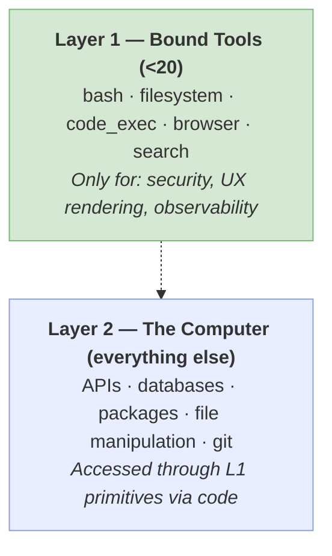

# Tool Design — Actions, MCP, and Progressive Disclosure

← [[01 - Foundations]] · → [[03 - Context]]

---

## Giving the Agent Hands — and Teaching It to Use Them

An agent that can reason but cannot act is just an expensive chatbot. Tools are what transform a language model from a thinking machine into a doing machine. But tool design is where many teams make their first critical mistake: they build too many tools, describe them poorly, and create an action space so cluttered that the model spends more time choosing what to do than actually doing it. Everything you learned in the Foundations chapter about "finding the simplest solution" and Law #1 ("give the agent a computer, not more tools") applies doubly here.

**The action space should have two layers** (see diagram above). **Layer 1** consists of fewer than 20 **bound tools** — these are atomic functions explicitly registered with the model: bash, filesystem read/write, code execution, browser, search [^13]. Each bound tool consumes tokens in every request (the model sees its name, description, and parameter schema), so every addition has a cost. **Layer 2** is everything the agent can do *through* those Layer 1 primitives: install packages, call APIs, query databases, manipulate files, use git [^13]. The model accesses Layer 2 by writing code that runs in the Layer 1 code interpreter — it doesn't need a dedicated "install_package" tool because it can write \`pip install pandas\` in bash.

The rule of thumb for when to create a dedicated bound tool versus letting the agent use code: create a bound tool **only** when you need a **security boundary** (the tool gates access through an auth layer the agent shouldn't bypass), **UX rendering** (the tool produces a specific display for the user), or **observability** (you need to trace this specific action in your monitoring) [^4]. Everything else should flow through code execution. When in doubt, err toward fewer tools.

**Programmatic Tool Calling (PTC)** takes the two-layer concept further [^12]. Instead of the model producing a JSON tool call that your harness executes, the model writes a *program* that calls tools as functions, executes intermediate logic, and returns only the final result. For example, instead of calling \`search("weather Paris")\` then waiting, then calling \`format_response(result)\`, the model writes a single code block: \`result = search("weather Paris"); return f"It's {result.temp}°C and {result.condition}"\`. The harness executes the entire program as a unit. Benchmarks show PTC can improve accuracy by 11% while reducing token usage by 24% [^12], because the model handles intermediate steps in code rather than through multiple round-trips. PTC is especially powerful when combined with tool handlers that gate every call — the handler can validate, log, and permission-check each function invocation within the code [35].

**Tool descriptions are a form of prompt engineering** — and perhaps the most underappreciated one [^3]. The description you write for each tool is literally part of the prompt the model sees on every request. A vague description leads the model to misuse the tool; an overly specific one leads it to avoid the tool in edge cases. In one documented case, refining tool descriptions alone — without changing any model, code, or architecture — achieved state-of-the-art benchmark scores [^3]. The optimization loop is empirical and iterative: run your evals, read the transcripts where the agent chose the wrong tool or used it incorrectly, feed those failing transcripts to a model for analysis of what went wrong, update the descriptions based on the analysis, and measure again [^3]. A good tool description includes: what the tool does (not just its name), when to use it (and when *not* to), what it returns (format, structure), and what to do if it fails (retry? rephrase? use a different tool? escalate?).

**MCP (Model Context Protocol)** [^46] is an open protocol that standardizes how agents connect to external data sources and tools. Think of it as a universal adapter: instead of building custom integrations for each tool provider, you implement MCP once and gain access to a growing ecosystem of MCP-compatible tools. MCP defines three primitives — **Resources** (data the agent can read), **Tools** (functions the agent can call), and **Prompts** (templates that guide interactions) — all discoverable at runtime. This matters for tool design because MCP tools should be **progressively disclosed** rather than all loaded as bound tools [^9][^13].

**Progressive disclosure** is the principle that the agent should see a menu of available capabilities without loading all the details until needed. The mechanism is **Skills** — metadata (a name and one-line description) is visible in context, but the full content (detailed instructions, examples, workflows) loads only when the agent decides to use that skill [^10]. This keeps the base context lean (recall Law #2: context is the bottleneck) while making a large library of capabilities discoverable. Without progressive disclosure, an agent with 50 skills would need all 50 skill prompts loaded into context permanently, consuming thousands of tokens and degrading performance. With it, the agent sees 50 one-liners and loads only the 2-3 it needs for the current task.

One final caution that connects to the Evaluation chapter: tool design is stubbornly empirical. What works beautifully for one model may break with the next release [^15]. The tool descriptions, the action space, the progressive disclosure strategy — all of it should be treated as a living design that evolves through evaluation, not as a specification you write once and ship. This is why the eval-transcript-iterate loop from [^3] is so important: it's not a one-time optimization, it's a continuous process.

With tools in place, your agent can act in the world. But acting well requires seeing clearly — having the right information, in the right format, at the right time. That's the domain of context engineering.

> [!summary] Key Takeaways
> 1. Layer 1 (bound tools) should stay under 20 — only for security, UX, or observability boundaries. Everything else is Layer 2 (via code).
> 2. Tool descriptions are prompt engineering — refine them empirically through the eval-transcript-iterate loop.
> 3. Progressive disclosure via Skills and MCP keeps context lean while making capabilities discoverable.
> 4. Tool design is model-dependent and empirical. What works for one model may break with the next release.

---

## References

[^3]: [Writing Effective Tools](https://www.anthropic.com/engineering/writing-tools-for-agents)
[^4]: [Harnessing Intelligence Patterns](https://claude.com/blog/harnessing-claudes-intelligence)
[^9]: [Prompt Caching Lessons](https://x.com/trq212/status/2024574133011673516)
[^10]: [Skills in Practice](https://x.com/trq212/status/2033949937936085378)
[^12]: [Programmatic Tool Calling](https://x.com/rlancemartin/status/2027450018513490419)
[^13]: [Agent Design Patterns](https://x.com/RLanceMartin/status/2024573404888911886)
[^15]: [Opinionated Agents](https://www.vtrivedy.com/posts/agents-should-be-more-opinionated)
[^46]: [MCP Specification](https://modelcontextprotocol.io/specification/2025-11-25)
